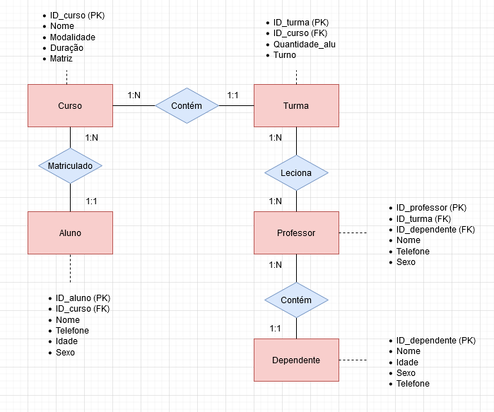
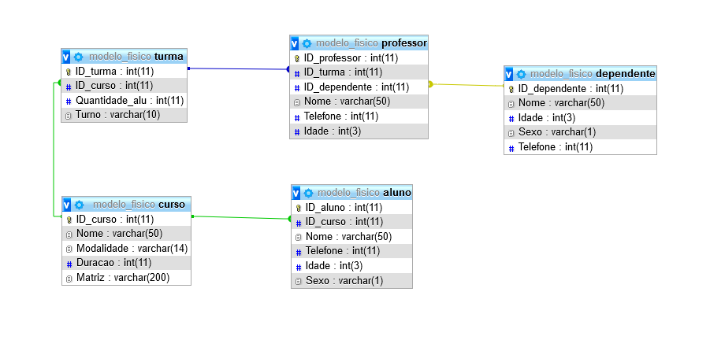

# Projeto individual - Sistema Resilia
Projeto individual do quarto módulo do curso de WebDev Full Stack da Resilia. A proposta foi modelar um banco de dados para o novo sistema de acompanhamento para a Resilia.

**Modelo conceitual**

**Modelo lógico**

**Modelo físico**
Arquivo "modelo_fisico.sql" no repositório.

## Tecnologias utilizadas
- MySQL
- Apache
- XAMPP
- Diagrams

## Execução
Carregue o "modelo_fisico.sql" no phpMyAdmin.

### Existem outras entidades além dessas três?
Sim, são elas: professor e dependente.

### Quais são os principais campos e tipos?
Os principais campos são as chaves primárias (ID_aluno, ID_curso, ID_turma, ID_professor e ID_dependente) e estrangeiras das entidades, sendo essas últimas responsáveis pelas relações. Os principais e únicos tipos utilizados foram o varchar o int.

### Como essas entidades estão relacionadas?
Da seguinte forma: Um aluno pode estar matriculado em um curso que contém uma turma ou mais. Essa turma conta com um professor ou mais que pode ter mais de um dependente.
